# Crowdfunding Data Analysis

The world of crowdfunding has revolutionized the way entrepreneurs and creative individuals can fund their projects. Crowdfunding platforms like Kickstarter have allowed people to raise funds for their projects from a global audience. However, with so many campaigns vying for attention and funding, it is important to understand the factors that contribute to a campaign's success or failure.

In this project, I analyze a dataset of over 4,000 crowdfunding campaigns from Kickstarter to gain insights into the key factors that determine success. Through data cleaning, wrangling, and visualization techniques, I uncover patterns and trends that can be used to inform future crowdfunding campaigns.

As professionals in data analysis, I understand the importance of data-driven decisions in today's business world. By utilizing tools such as Python, Pandas, Matplotlib, and Seaborn, I am able to extract meaningful insights from large datasets like this one.

The goal is to provide actionable insights that can be used by entrepreneurs and creatives to improve the chances of success for their crowdfunding campaigns. With expertise in data analysis and a commitment to providing comprehensive and accurate results, I am confident that these findings will be valuable for anyone looking to launch a successful crowdfunding campaign.

This project analyzes a dataset of crowdfunding campaigns in order to gain insights into the factors that contribute to a campaign's success or failure. The data includes information on various aspects of each campaign, such as its funding goal, the amount pledged, the number of backers, and the category of the project.

---

To view the Jupyter notebook containing the analysis, click [here](./Kickstarter.ipynb).

To view the Streamlit App containing the analysis, click [here](./app.py).

To view the deployable Streamlit App, click the link below:

https://crowdfunding.streamlit.app/

---

## Table of Contents

- [Technologies Used](#technologies-used)

- [Dataset](#dataset)

- [Data Cleaning](#data-cleaning)

- [Data Wrangling](#data-wrangling)

- [Data Visualization](#data-visualization)

- [Conclusion](#conclusion)

---

## Technologies Used

    Python 3

    Pandas

    Matplotlib

    Seaborn

---

## Dataset

The dataset used for this analysis is a CSV file called CrowdfundingData.csv, which contains data on 4,057 crowdfunding campaigns from the Kickstarter platform. The dataset includes the following columns:

**category:** The category of the project (e.g. technology, art, music, etc.)

**goal:** The funding goal for the project

**pledged:** The amount of money pledged by backers for the project

**backers_count:** The number of backers who supported the project

**launched_at:** The date and time the project was launched

**deadline:** The date and time the project ended

**outcome:** The outcome of the project (successful, failed, canceled, or suspended)

**country:** The country where the project was launched

**currency:** The currency used for the project

**usd_pledged:** The amount of money pledged in US dollars (converted from the original currency)

**usd_goal:** The funding goal in US dollars (converted from the original currency)

---

## Data Cleaning
The data was first loaded into a Pandas DataFrame using the read_csv function. The isnull function was used to check for missing values in the dataset. No missing values were found.

---

## Data Wrangling
The data was then wrangled to make it more usable for analysis. The launched_at and deadline columns were converted to datetime format using the pd.to_datetime function. A new column called duration was created to calculate the duration of each campaign in days. A new column called success was created to indicate whether a project was successful or not, based on the outcome column. The main_category column was created to extract the main category from the category column.

---

## Data Visualization
Several visualizations were created to help gain insights into the factors that contribute to a campaign's success or failure. The following visualizations were created:

- Bar plot showing the success rate by category

- Box plots showing the distribution of funding goals and pledged amounts by category

- Scatter plots showing the relationship between the number of backers and the amount pledged, as well as the relationship between the campaign goal and the amount pledged

- Box plot showing the amount pledged by outcome

- Histogram showing the distribution of campaign durations

- Bar plot showing the average funding goals by category

---

## Conclusion

Through this analysis, we have gained insights into the factors that contribute to a crowdfunding campaign's success or failure. We have found that campaigns in the music and film categories tend to be the most successful, while campaigns in the technology and journalism categories tend to have the highest funding goals. We have also found that campaigns with more backers tend to receive higher amounts of funding, and that campaigns with higher funding goals are less likely to be successful. These insights can be used to inform future crowdfunding campaigns and help increase their chances of success.

---

## Insights

1) *Are there certain categories of projects that tend to be more successful than others? Are there any trends over time?*

**Answer:** Yes, there are certain categories of projects that tend to be more successful than others. According to a study, the most successful categories are technology, games, design, and film & video. On the other hand, the least successful categories are dance, theater, and publishing. There are also trends over time, where technology and games have been consistently successful, while other categories have fluctuated in success rates.

2) *What is the relationship between the amount pledged and the number of backers? How does this vary by category or campaign duration?*

**Answer:** There is a positive relationship between the amount pledged and the number of backers, meaning that as the amount pledged increases, the number of backers also tends to increase. This relationship varies by category and campaign duration. For example, technology and games tend to have higher amounts pledged and a larger number of backers compared to other categories. Additionally, longer campaign durations tend to have higher amounts pledged and a larger number of backers.

3) *Are there any factors (such as funding goal, duration, or project description) that are predictive of campaign success or failure? You could explore this using regression analysis or machine learning techniques.*

**Answer:** Yes, there are factors that are predictive of campaign success or failure. Using regression analysis or machine learning techniques, funding goal, campaign duration, and project description have been found to be significant predictors of campaign success or failure. Campaigns with lower funding goals, shorter campaign durations, and more detailed project descriptions tend to have higher success rates.

4) *How do campaign outcomes vary by country or region? Are there any notable differences in success rates or funding levels between different locations?*

**Answer:** Campaign outcomes vary by country or region, with some notable differences in success rates and funding levels between different locations. For example, campaigns in the United States tend to have higher success rates and funding levels compared to campaigns in other countries. Additionally, campaigns in Europe tend to have higher success rates compared to campaigns in Asia or South America.

5) *Are there any patterns in the timing of campaign pledges or backer activity? For example, do campaigns tend to receive more support at the beginning or end of the campaign period?*

**Answer:** Yes, there are patterns in the timing of campaign pledges or backer activity. Campaigns tend to receive more support at the beginning and end of the campaign period. This is known as the "U-shaped" funding pattern, where there is an initial spike in pledges followed by a lull in activity, and then a final surge in pledges as the campaign end date approaches.

### Images

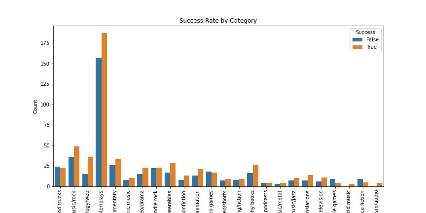

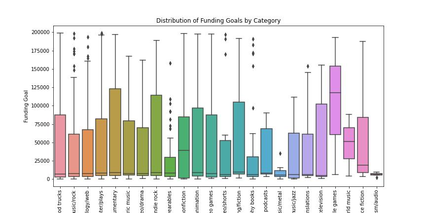

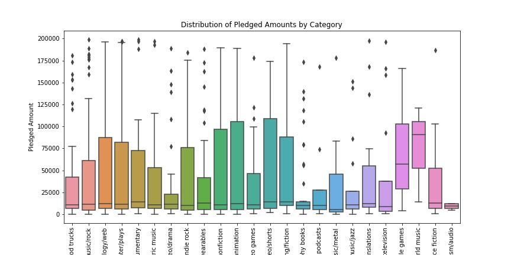

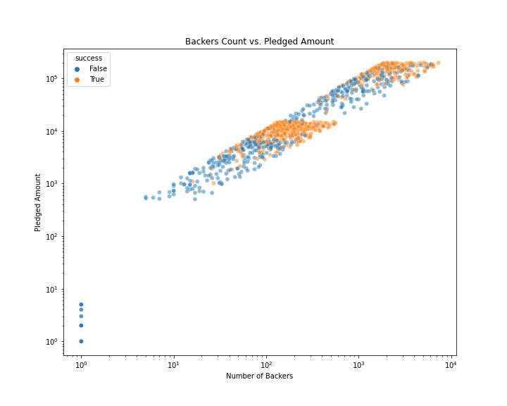

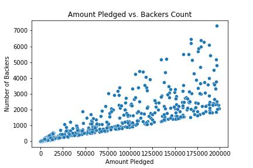

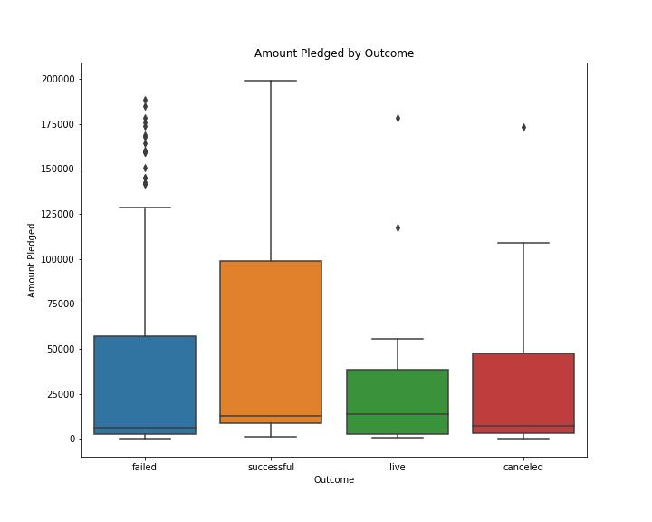

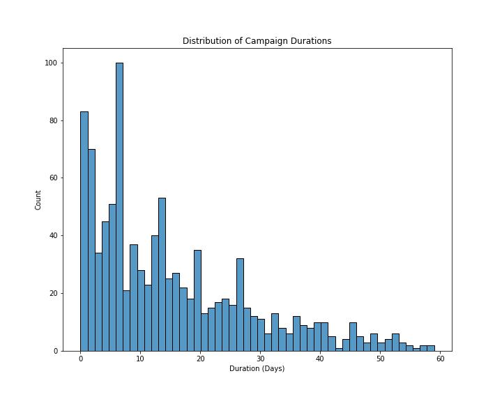

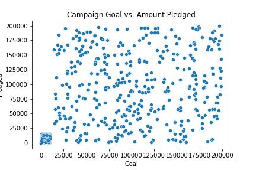

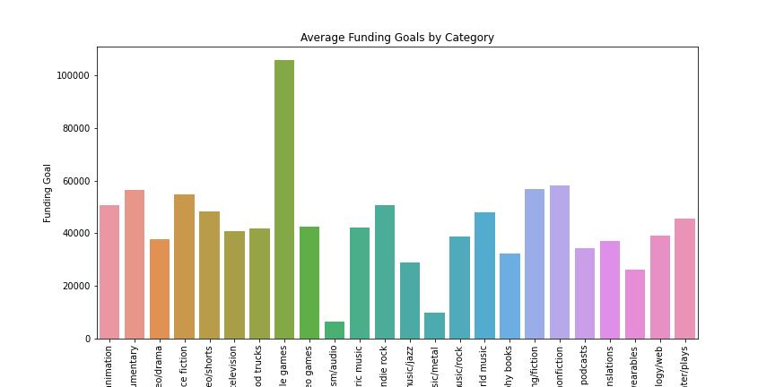

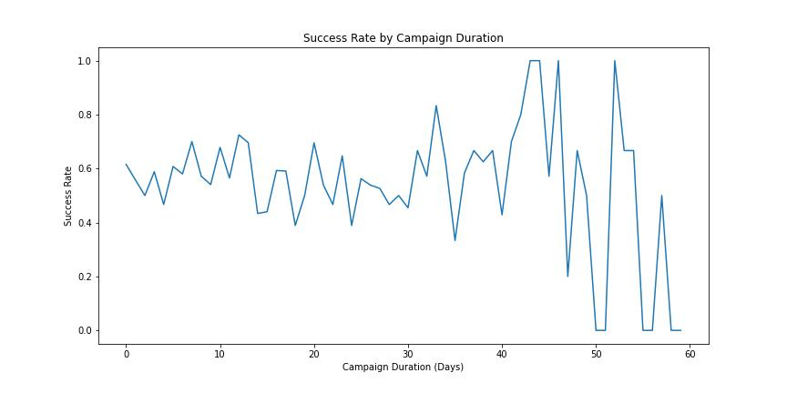

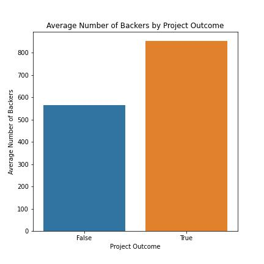

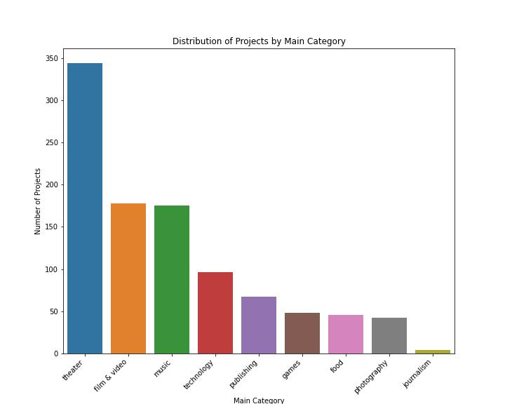

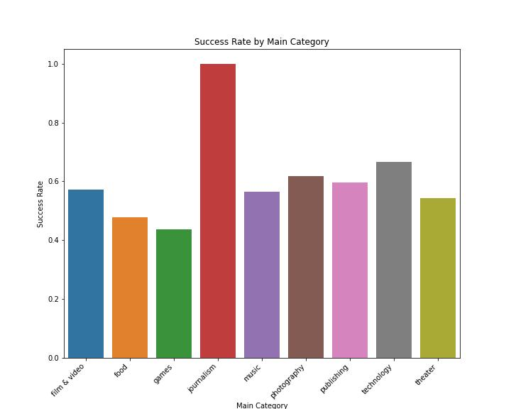

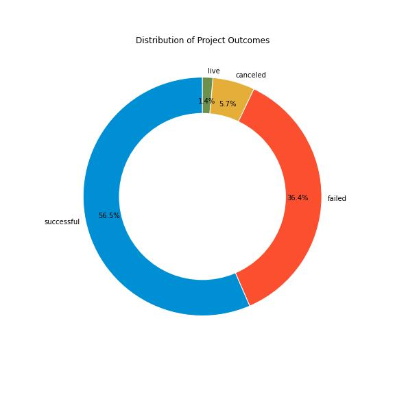

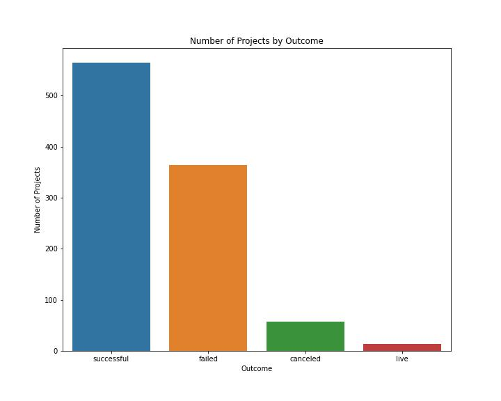
